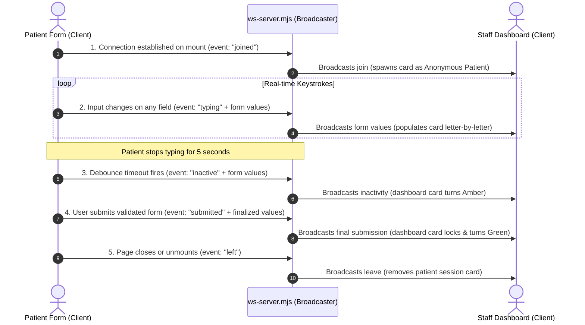

# Agnos Patient Portal & Real-Time Sync Dashboard

A state-of-the-art Next.js 15 web application designed for real-time patient registration and live staff monitoring. This portal enables healthcare staff to view patient form inputs as they are typed, track patient activity statuses, and streamline patient intake.

---

## 📖 Project Overview

This project consists of two primary views connected via WebSockets:

1. **Patient Registration Form (`/patient-form`)**: A fully validated patient registration form containing demographic details, contact info, preferred language, and emergency contacts.
2. **Live Synchronization Dashboard (`/patient-dashboard`)**: A responsive workspace for staff members to monitor patient sessions in real-time. It tracks exactly what fields are being filled out letter-by-letter, and shows active status indicators.

---

## 🚀 Setup & Execution Instructions

Follow these steps to run the complete synchronization pipeline locally.

### 1. Install Dependencies

Run the package installation command to configure all standard and WebSocket dependencies:

```bash
npm install
```

### 2. Start the WebSocket Server

The server coordinates all live data transmission between form pages and the dashboard:

```bash
node ws-server.mjs
```

_Note: The WebSocket server will bind to `ws://localhost:8080`._

### 3. Run the Next.js Development Server

Start the front-end application server:

```bash
npm run dev
```

Open your browser and navigate to the Home Portal at: **[http://localhost:3000](http://localhost:3000)**.

### 4. Run the Real-Time Typing Simulation (Alternative to manual typing)

To watch the dashboard sync automatically without typing manually:

1. Keep the dashboard tab open at **[http://localhost:3000/patient-dashboard](http://localhost:3000/patient-dashboard)**.
2. Run the simulation script in your terminal:
   ```bash
   node scripts/send-mock-typing.mjs
   ```

---

## 🌟 Implemented Bonus Features

- **Real-time Keystroke Synchronization**: Input fields are sent letter-by-letter over WebSockets. Staff see what the patient is typing in real-time, helping them anticipate patient needs.
- **Patient Status Life-Cycle Indicators**:
  - 🔵 **Connected**: Appears when a patient opens the form page.
  - 🟢 **Active (Typing)**: Appears whenever the patient is actively inputting or editing fields.
  - 🟡 **Inactive**: Automatically triggers if the patient stops typing for more than **5 seconds**.
  - ✅ **Submitted**: Appears when the form successfully validates and is submitted.
- **Tab/Page Exit Cleanup (`left` event)**: If the patient closes the browser tab or navigates away, the session is cleanly removed from the dashboard to keep the interface tidy.
- **Concurrent Multi-Client Sessions**: Unique `sessionId`s are generated on component mount. Multiple patients can fill out forms simultaneously, and each session is tracked separately on the dashboard.

---

## 📂 Project Structure

```text
├── public/                 # Static assets (icons, images)
├── src/
│   ├── app/
│   │   ├── layout.tsx      # Main layout wrapper
│   │   ├── page.tsx        # Homepage portal navigation
│   │   ├── patient-dashboard/
│   │   │   └── page.tsx    # Live Sync Dashboard page component
│   │   └── patient-form/
│   │       └── page.tsx    # Registration form component
│   ├── components/
│   │   ├── baseButtonComponents.tsx      # Standardized Button component
│   │   ├── baseDateInputComponents.tsx    # Custom date picker input
│   │   ├── baseDisplayComponents.tsx     # Dashboard data field viewer
│   │   ├── baseInputComponents.tsx       # Standard text input component
│   │   ├── baseSelectComponents.tsx      # Select dropdown component
│   │   └── baseTextareaComponents.tsx    # Multi-line text input component
│   ├── lib/
│   │   ├── schema/
│   │   │   └── patientFormSchema.ts      # Zod validation schema
│   │   └── types/
│   │       ├── baseComponentTypes.ts     # Component prop types
│   │       ├── basePatientTypes.ts       # Patient session types
│   │       └── waStatusTypes.ts          # WebSocket state types
│   ├── mockData/
│   │   └── dropdownData.ts # Data lists for form options
│   └── utils/
│       └── patientStatus.tsx             # Helper components for status badges
├── package.json            # NPM configuration & dependencies
├── ws-server.mjs           # Standalone WebSocket Server (ES Module)
└── tsconfig.json           # TypeScript configuration
```

---

## 🎨 UI/UX Design Decisions

The design prioritizes visual clarity, responsive adaptability, and modern aesthetics using TailwindCSS:

1. **Responsive Card Grids (Mobile-First)**:
   - On mobile screens, patient cards fold into a stacked single column to prevent horizontal scrolling.
   - On medium and large screens, the card expands to a clean 3-column layout (Demographics, Contact, and Emergency Contact).
2. **Interactive States & Color Coding**:
   - Statuses use distinct, globally understood colors (Blue for active/typing, Amber for inactive warning, Green for complete/submitted) with glowing, pulsing borders to immediately draw staff attention.
3. **Graceful Degradation (Placeholders)**:
   - Form fields that are not yet filled show light grey italicized tags (e.g. _(Typing...)_ or _(Not selected)_) instead of blank gaps, assuring staff that the connection is active and waiting for inputs.

---

## 🧩 Component Architecture

The codebase relies on reusable, clean, and decoupled component designs:

- **Base Input Fields (`BaseInput`, `BaseSelect`, `BaseTextarea`, `BaseDateInput`)**: Wrapped with React Hook Form's `<Controller />` to ensure seamless integration with the validation context while encapsulating consistent borders, focus outlines, and validation error messages.
- **`BaseDisplayComponents`**: A simple, unified component used on the Dashboard to render titles, data, or grey placeholders depending on whether the payload property is empty.
- **`PatientStatus` & `PatientBadge` Helpers**: Encapsulate status styling and classes, making status icons and text tags easily modifiable in a single place.

---

## 🔄 Real-Time Synchronization Flow

The communication flow is built on top of native WebSockets:


